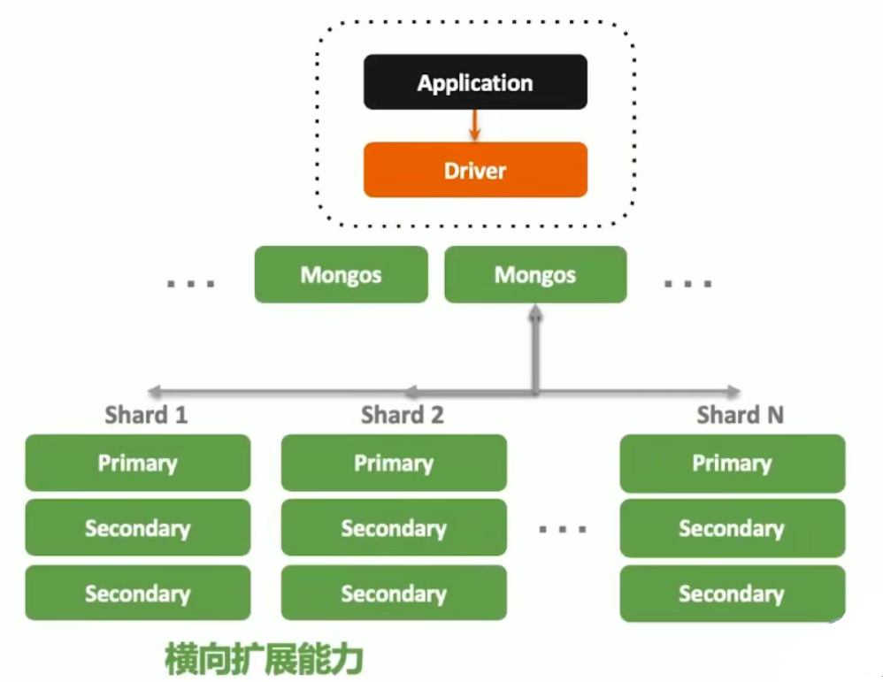

# 1、认识文档数据库mongoDB

## 1-1 关于 MongoDB

| 问题                  | 介绍                                                         |
| --------------------- | ------------------------------------------------------------ |
| 什么是`MongoDB`?      | 一个以`JSON` 为数据模型的文档数据库。                        |
| 为什么叫文档数据库？  | 文档来自于 "`JSON Document`"，并非我们一般理解的 `PDF`，`WORD` 文档。 |
| 谁开发 `MongoDB`?     | 上市公司 `MongoDB Inc`，总部位于美国纽约。                   |
| 主要用途？            | 应用数据库，类似于 `Oracle`、`MySQL`。                       |
| 主要特点？            | 建模为可选；`JSON`数据模型比较适合开发者；**横向扩展**可以支撑很大数据量和并发。 |
| `MongoDB`是免费的吗？ | `MongoDB` 有两个发布版本：社区版和企业版。社区版是基于 `SSPL`，一种和 `AGPL`基本类似的开源协议。企业版是基于商业协议，需付费使用。 |

## 1-2 MongoDB vs. 关系型数据库

|              | MongoDB                                                     | RDBMS                  |
| ------------ | ----------------------------------------------------------- | ---------------------- |
| 数据模型     | 文档模型                                                    | 关系模型               |
| 数据库类型   | OLTP                                                        | OLTP                   |
| CRUD 操作    | MQL/SQL                                                     | SQL                    |
| 高可用       | 复制集                                                      | 集群模式               |
| 横向扩展能力 | 通过原生分片完善支持                                        | 数据分区或者应用侵入式 |
| 索引支持     | B-树、全文索引、地理位置索引、多键（multikey）索引、TTL索引 | B 树                   |
| 开发难度     | 容易                                                        | 困难                   |
| 数据容量     | 没有理论上限                                                | 千万、亿               |
| 扩展方式     | 垂直扩展 + 水平扩展                                         | 垂直扩展               |

# 2、MongoDB 特色及优势

## 2-1 面向开发者的易用 +高效数据库

- 简单直观：以自然的方式来建模，以直观的方式来与数据库交互。	
  - 一目了然的对象模型:


- 结构灵活：弹性模式从容响应需求的频繁变化
  - 多形性: 同一个集合中可以包含不同字段 (类型) 的文档对象。
  - 动态性: 线上修改数据模式, 修改时应用与数据库均无需下线。
  - 数据治理：支持使用 `JSON Schema` 来规范数据模式。在保证模式灵活动态的前提下，提供数据治理能力。
- 快速开发：做更多的事，写更少的代码
  - 数据库引擎只需在一个存储区读写
  - 反范式、无关联的组织极大优化查询速度
  - 程序 API 自然，开发快速。

##  2-2 原生的高可用的横向扩展能力


- Replica Set - 2 to 50 个成员
- 自恢复
- 多中心容灾能力
- 滚动服务 - 最小化服务终端

## 2-3 横向扩展能力 (通过分片集群)



- 需要的时候无缝扩展
- 应用全透明
- 多种数据分布策略
- 轻松支持 TB - PB 数量级

## 2-4 MongoDB 技术优势总结

- `JSON` 结构和对象模型接近，开发代码量低
- `JSON`的动态模型意味着更容易响应新的业务需求
- 复制集提供 99.999% 高可用
- 分片架构支持海量数据和无缝扩容

# 3、安装 MongoDB

##  3-1 下载 MongoDB

- [下载地址](https://www.mongodb.com/try/download/community)
- 企业版 - 开发环境免费试用
- 社区版 - 所有环境免费试用
- 选择合适的 OS 版本
- `TGZ` 版本包含 `server mongos tools` 和 `shell`

## 3-2 建立云服务

使用 [MongoDB Atlas 云数据库](https://www.mongodb.com/cloud/atlas)。

创建并连接的流程如下：


数据库的 `whitelist` 如果想要全放开可以写成 0.0.0.0/0

可以通过查看自己的公网ip:

- 国内：[问百度](https://www.baidu.com/s?wd=ip&rsv_spt=1&rsv_iqid=0xc897c22a000423b7&issp=1&f=8&rsv_bp=1&rsv_idx=2&ie=utf-8&rqlang=cn&tn=baiduhome_pg&rsv_enter=1&rsv_dl=tb&oq=%25E5%25A6%2582%25E4%25BD%2595%25E6%259F%25A5%25E7%259C%258B%25E5%2585%25AC%25E7%25BD%2591ip&rsv_t=ade5GNfuY6fQ0IF0T6Za77w4hWWA6oMKg8Voob5HWyZQynZAIxeyubgfRAS8KpWI4s5A&rsv_btype=t&inputT=1810&rsv_pq=df02d27a00015fbb&rsv_sug3=48&rsv_sug1=25&rsv_sug7=100&rsv_sug2=0&rsv_sug4=1810)

- 国外：https://ifconfig.me/


可以在 `<dbname>` 的地方替换成 test；如果出现错误： 

> It looks like this is a MongoDB Atlas cluster. Please ensure that your IP whitelist allows connections from your network.

那就把自己的`vpn`换成直连的形式，重新添加自己的`whitelist`


## 3-3 导入样本数据

本地解压样本数据，将样本数据放在自己`mongodb`文件夹里的data文件夹里面。


然后输入: `mongo`进入数据库;

然后输入：`show dbs`，就能发现自己恢复的样本数据；


## 3-4 用 `Compass` 管理数据库

[Compass 下载地址](https://www.mongodb.com/try/download/compass)


# 4、MongoDB基本操作

进入本地的`mongodb`数据库：进入安装的`mongdb`文件夹的`data`文件夹下，然后打开`cmd`输入`mongo`。

## 4-1 使用 insert 完成插入操作

```shell
# 操作格式：
# db.<集合>.insertOne(<JSON对象>)
# db.<集合>.insertMany([<JSON1>, <JSON2>, ...<JSON n>])

# 示例：
db.fruit.insertOne({ name: "apple" });
db.fruit.insertMany([
	{ name: "apple" },
	{ name: "pear" },
	{ name: "orange" }
])
```

## 4-2 使用 find 查询文档

```shell
# 关于 find：
# find 是 mongodb 中查询数据的基本指令，相当于 SQL 中的 select
# find 返回的是游标

# 示例
db.movies.find({ "year": 1975 }) # 单条件查询
db.movies.find({ "year": 1989, "title": "Batman" }) # 多条件 and 查询
db.movies.find({ $and: [{ "title": "Batman" }, { "category": "action" }] }) # and 的另一种形式
db.movies.find({ $or: [{ "year": 1989 }, { "title": "Batman" }] }) # 多条件 or 查询
db.movies.find({ "title": /^B/ }) # 按照正则表达式查找
```

### 查询条件对照表：

| SQL             | MQL                                              |
| --------------- | ------------------------------------------------ |
| a = 1           | { a: 1 }                                         |
| a <> 1          | { a: { $ne: 1 } }                                |
| a > 1           | { a: { $gt: 1 } }                                |
| a >= 1          | { a: { $gte: 1} }                                |
| a < 1           | { a: { $lt: 1 } }                                |
| a <= 1          | { a: { $lte: 1 } }                               |
| a = 1 AND b = 1 | { a: 1, b: 1 } 或 { $and: [{ a: 1 }, { b: 1 }] } |
| a = 1 OR b = 1  | { $or: [{ a: 1 }, { b: 1 }] }                    |
| a IS NULL       | { a: {$exists: false } }                         |
| a IN (1, 2, 3)  | { a: {$in: [1, 2, 3] } }                         |

### 查询逻辑运算符：

- $lt: 存在并小于
- $lte: 存在并小于等于
- $gt: 存在并大于
- $gte: 存在并大于等于
- $ne: 不存在或存在但不等于
- $in: 存在并在指定数组中
- $nin: 不存在或不在指定数组中国
- $or: 匹配两个或多个条件中的一个
- $and: 匹配全部条件

### 使用 find 搜索子文档

- find 支持 “`field.sub_field`” 的形式查询子文档。

```shell
db.fruit.insertOne({
	name: "apple",
	from: {
		country: "China",
		province: "Guangdong"
	}
})
```

- 考虑以下查询的意义：

```shell
db.fruit.find({ "from.country": "China" })
db.fruit.find({ "from": { country: "China" } })
```


